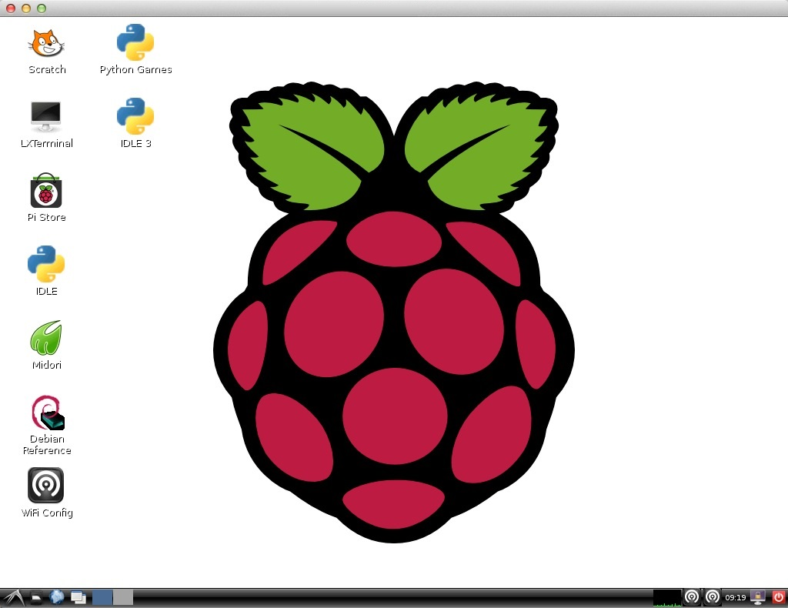



#shumeipai(树莓派)

树莓派玩机教程

你可以使用你的浏览器访问

本资源主页:http://flyher.github.io/shumeipai/index2.html

MrakDown版本索引页面:http://flyher.github.io/shumeipai/ [未完成]

test
===
更新时间：2014-07-04

更新栏目:

http://flyher.github.io/shumeipai/index.html

===

更新时间：2014-06-23

更新栏目：

1.markdown化开始；

===

更新时间:2014-04-26

更新栏目:

1.增加两张资料片,格式pdf（当前资料片114篇)

2.有时间我会加个索引pdf输出到html的方法

===
更新时间:2014-04-23

更新栏目：

1.删除重复资源；

2.索引目录；

===

##感谢和声明
######感谢奋斗在树莓派一线的人们
######本资源大部分内容均来自网络，我只是整理、修改和编辑，并未征得原创作者的同意，也无法一一保证所有文章内容的实时性和可操作性。如果你是作者，需要加上版权链接或者需要删除本文你的文章，请Email我删除。
######如果你有什么关于树莓派的玩机资源，你可以Fork该项目，新建Develop分支，添加资源内容的Html和Mrakdown版本(尽量有Mrakdown版本，本资源已经正在转换至Mrakdown版本中)，我会尽量及时合并分支。
######为了保证资源质量，请在提交时尽量不要将链接贴在文章中，如需引用参考文档，请使用 标题超链接的形式，并尽量保留原文版权信息。

